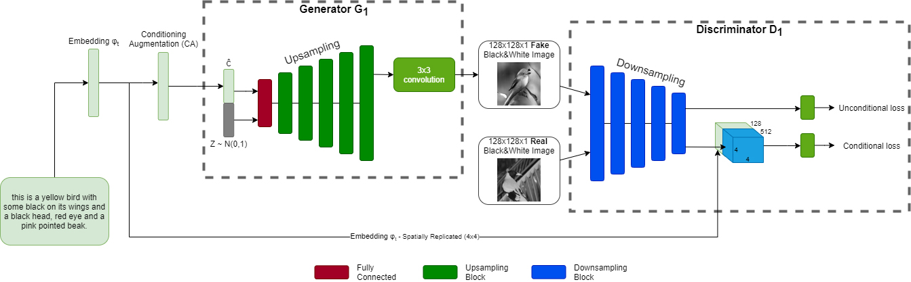
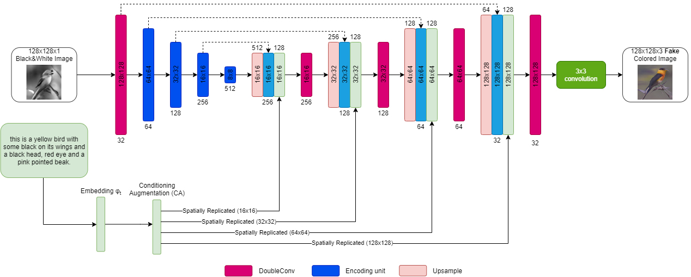
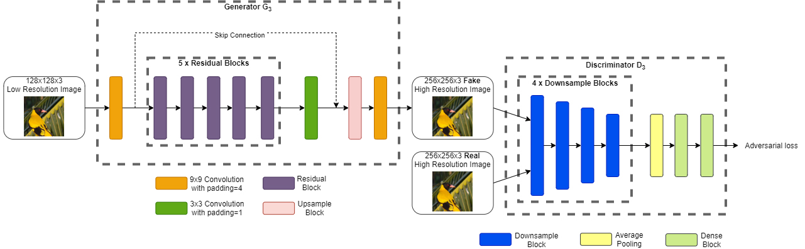
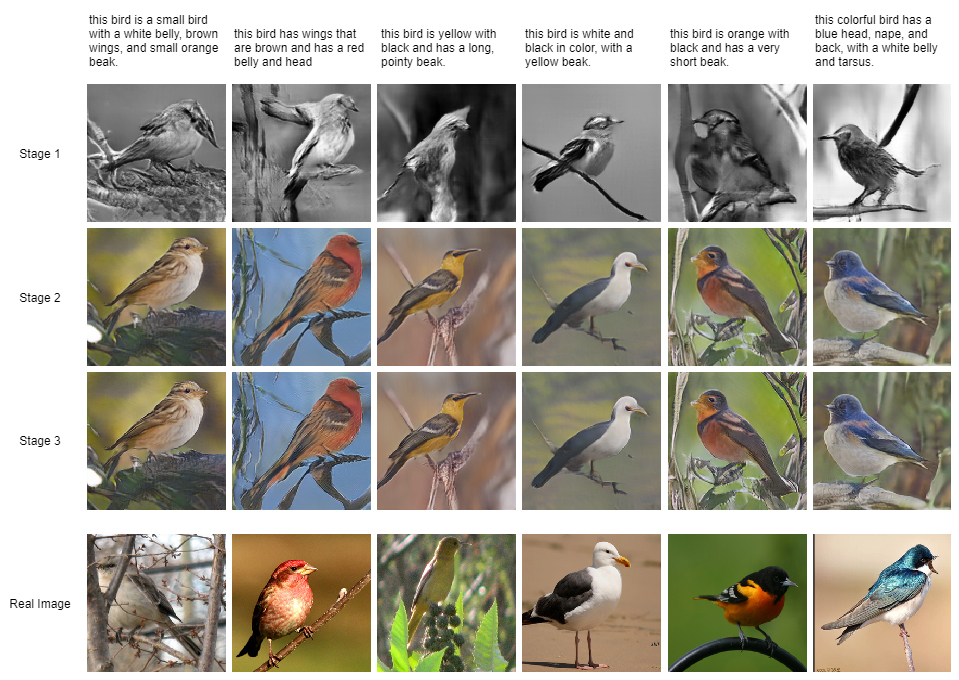
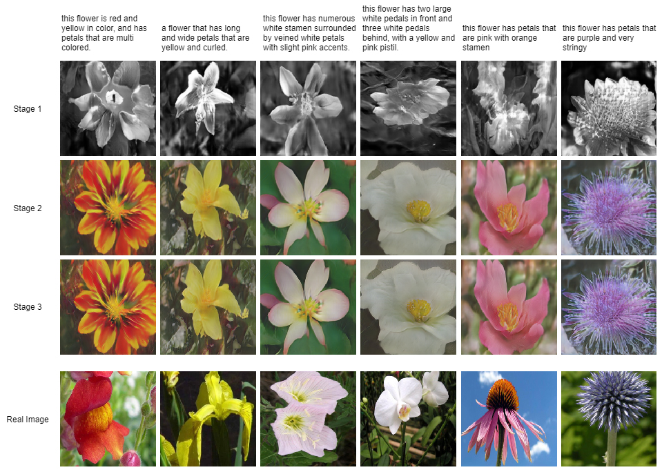

<h1>TeleGAN</h1>

Pytorch implementation for reproducing the results shown below by the TeleGAN model for text to image synthesis.

<h2>Model architecture</h2>

<p align="justify">TeleGAN decomposes the difficult problem of generating images of high quality based on text descriptions into more manageable sub-problems.
In order to do so, it consists of three consecutive stages. At the first stage it generates a black and white image of 128x128 resolution. At the
second stage it adds the color information given by the corresponding text description. Finally, at the third and last stage it enhances the colored
image generated by the second stage to higher resolution (256x256).</p>

Our model utilizes previous work in the fields of <a href="https://arxiv.org/abs/1803.05400">colorization</a> and <a href="https://arxiv.org/abs/1609.04802">super-resolution</a>, for the second and third stage respectively.

<h3>Stage 1</h3>
</img>

<h3>Stage 2</h3>
</img>

<h3>Stage 3</h3>
</img>

<h2>Data</h2>
<ol>
  <li>Download the preprocessed char-CNN-RNN text embeddings for birds and flowers by <a href="https://github.com/reedscot/icml2016">reedscot/icml2016</a></li>
  <li>Download the image data for both datasets (<a href="http://www.vision.caltech.edu/visipedia/CUB-200-2011.html">birds</a>, <a href="https://www.robots.ox.ac.uk/~vgg/data/flowers/102/">flowers</a>)</l1>
  <li>Modify the paths in the <a href="../config.json">config.json</a> file to point to the corresponding data</li>
  <li>Use <a href="../hdf5_converter.py">hdf5_converter.py</a> to create an .h5 file for each dataset</li>
 </ol>


<h2>Dependencies</h2>


Python 3.8 and Pytorch 


Also, please install the necessary packages listed in the <a href="requirements">requirements</a> file, using the following command:

`pip install -r requirements`


<h2>Training</h2>
You could train the model as follows:

```
# Stage 1
from telegan import TeleGAN
obj = TeleGAN("path/to/flowers.h5", "path/to/results/dir")
obj.train(1)

# Stage 2
from telegan import TeleGAN
obj = TeleGAN("path/to/flowers.h5", "path/to/results/dir")
obj.train(2, "path/to/generator.pkl") # from stage 1

# Stage 3
from telegan import TeleGAN
obj = TeleGAN("path/to/flowers.h5", "path/to/results/dir")
obj.train(3, "path/to/generator.pkl") # from stage 2
```

Please check the corresponding documentation for modifiable parameters for the training process.

<h2>Examples</h2>
<h3>CUB</h3>
</img>


<h3>Flowers</h3>
</img>
